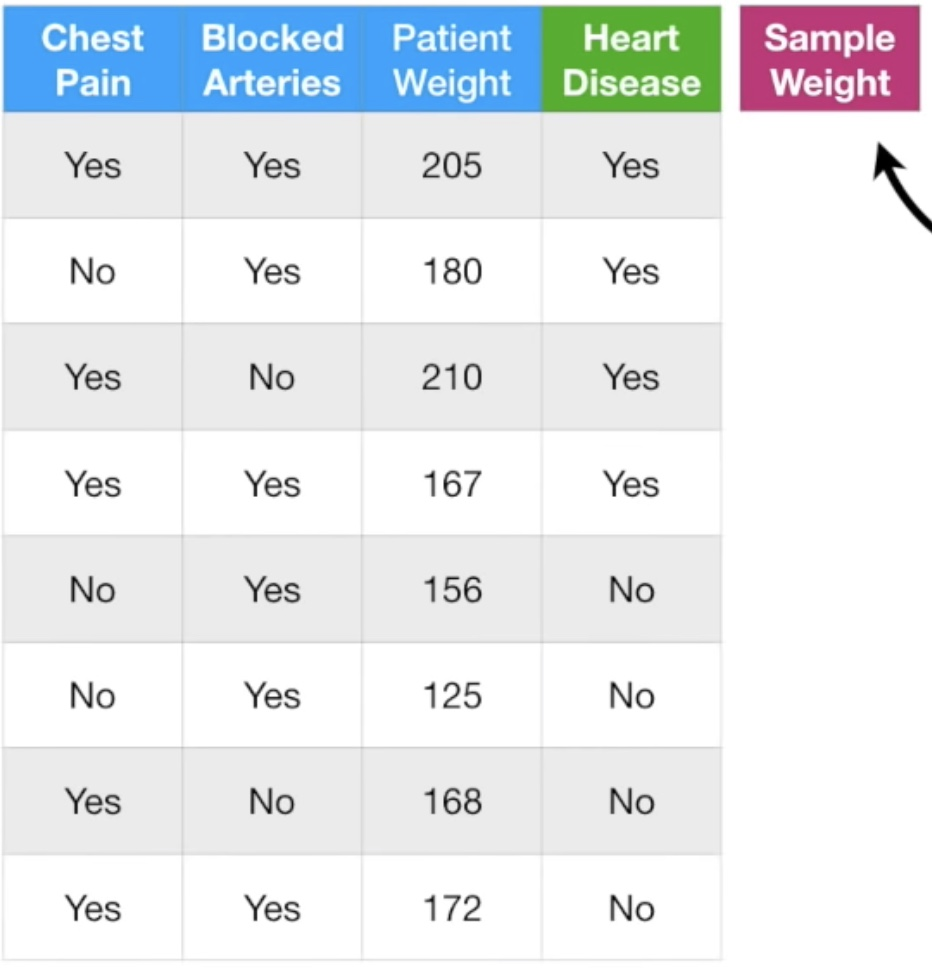
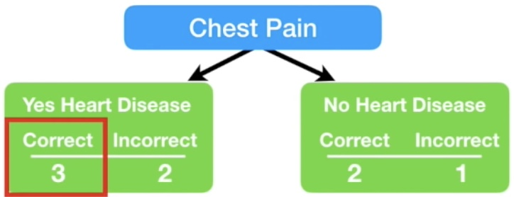
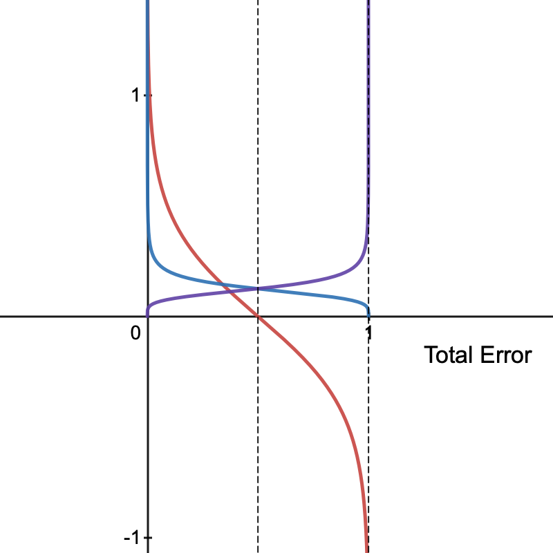
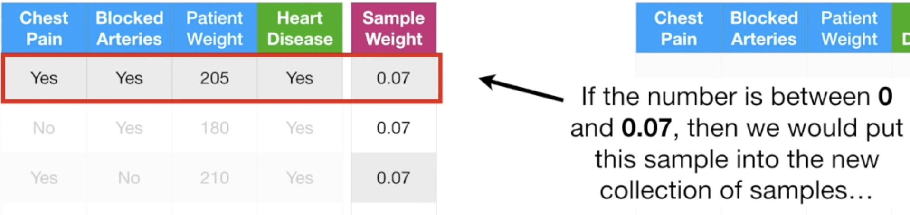
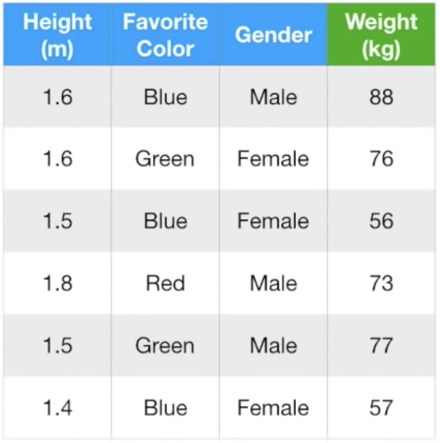
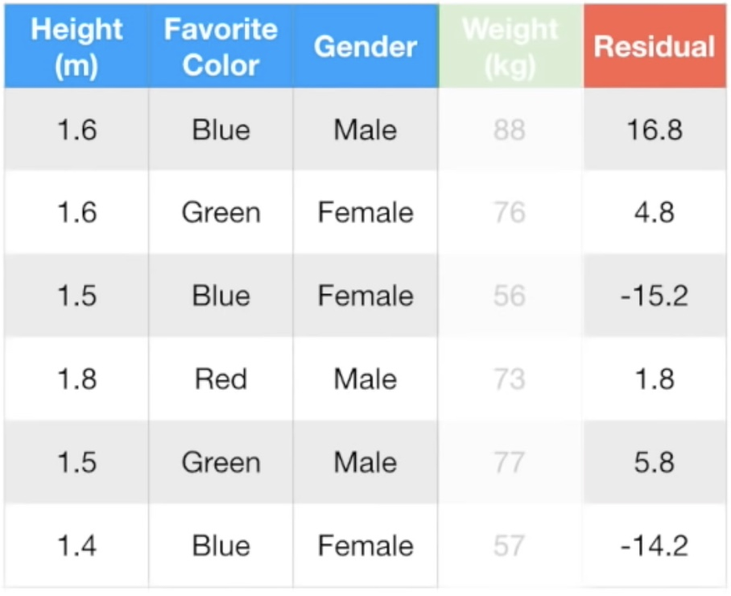
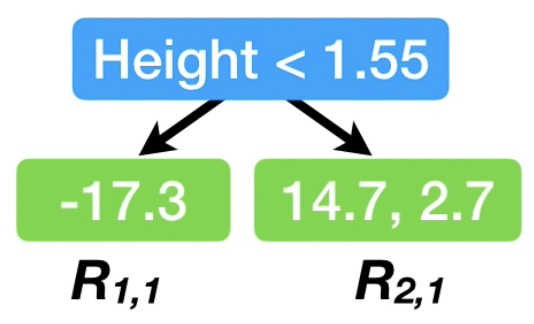
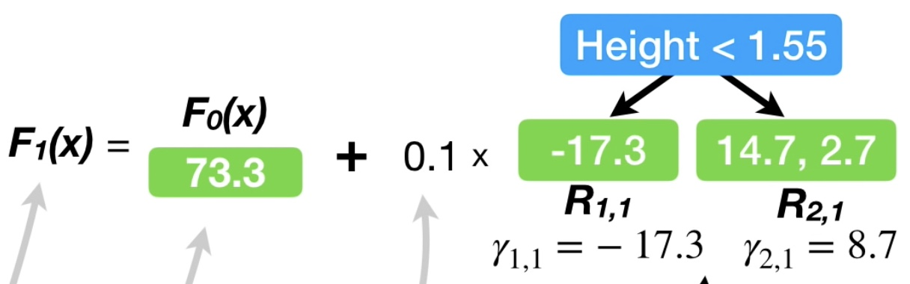
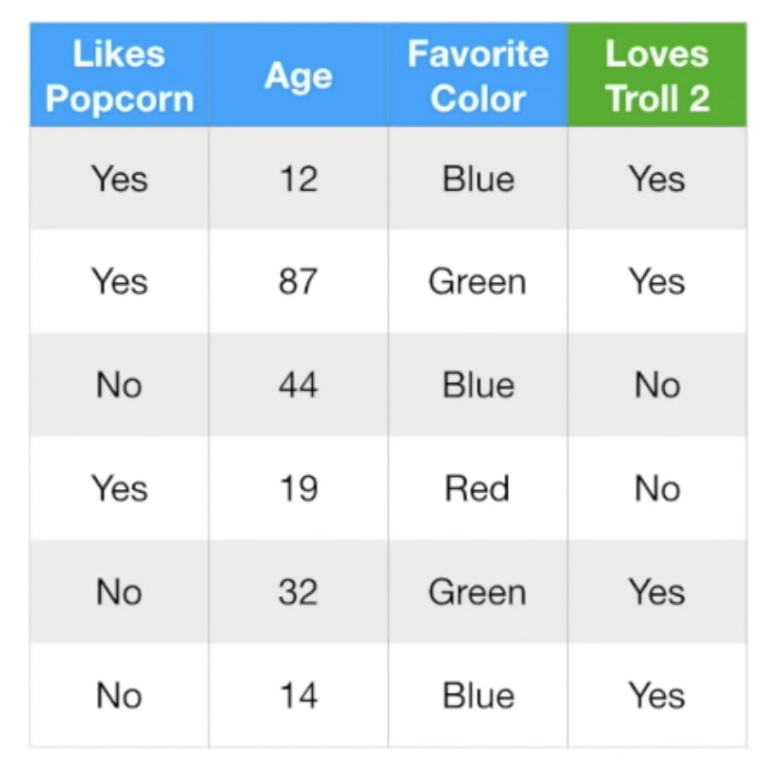
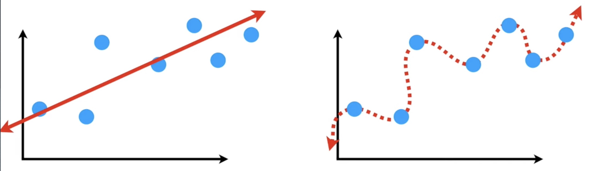

# Table of Contents
[AdaBoost](#adaboost)

[Gradient Boost](#gradient-boost)

[Bias and Variance](#bias-and-variance)

[Boosting and Loss Functions](#boosting-and-loss-functions)
<!---toc--->

# Notes
[Documentation for google laTex](https://developers.google.com/chart/infographics/docs/formulas?hl=en)

# AdaBoost

I'm learning this method to gain a fundamental understanding of XGBoost, which is a popular classifier algo and used in Litchfield et al, 2021.

#### StatQuest

Table 1

Concept
1. Combines a lot of "weak learners" to make classifications
2. Weak leaners are usually stumps (1 node, 2 leaf decision trees)
3. Stumps are weighted
4. The order of each stump is important: errors of first stump influence that of next, etc

Algorithm
1. Each sample (row of table with column factors and classification as last column) gets a sample weight, starting as 1/N.
2. First take the single factor that does the best job classifying samples (example chest pain in Table 1, to do this calculate Gini Impurity index for each stump)
    1. Gini impurity for each leaf = 1 - P(Yes)^2 - P(No)^2
    2. Index = (N_leaf1/N_total) * G(leaf1) + (N_leaf2/N_total) * G(leaf2)
3. Calculate Gini Impurity index for each stump and use the stump with lowest index as the first stump
    1. Example: Chest pain yes -> how many correct yes and incorrect yes? Chest pain no -> how many correct no and incorrect no?
    2. 
4. Calculate total error for the first stump (sum of **SAMPLE WEIGHTS** of incorrectly classified samples divided by total samples)
5. `Amount of say = 1/2 log((1 - Total Error)/Total Error)`
    1. Figure 1, red line
    2. Total Error goes from 0 to 1
    3. The graph looks like a log plot rotated 90 deg
        1. Low error = positive weight
        2. 50% error is like coin flip = 0 weight
        3. High error = negative weight
        4. Equation is not good for 0 and 1, so error term is added in practice
6. Update all sample weights before moving on to next stump, higher sample weights for incorrectly classified samples
    1. **Incorrectly classified samples:** `New sample weight = sample weight * exp(amount of say)`
        1. Why exp? If the amount of say is good, we scale with a large number
        2. Figure 1, blue line
    2. **Correctly classified samples:** `New sample weight = sample weight * exp(-amount of say)`
        1. Figure 1, purple line
    3.  Figure 1
7. Normalize new sample weights to get 1 (divide each new sample weight by sum of total new weights)
8. Generate the second stump, using new weights
    1. Can use weighted Gini index to determine variable for next stump
    2. Or generate another table that takes into account weights
9. In this case, use second method
    1. Randomly pick a number from 0 to 1
    2. Use the new weights of samples as like a cumulative function, depending on where the random number falls, pick the sample with the closest cumulative weight
        1.  Figure 2
    3. Iterate this process until new table samples match the old
    4. Assign baseline weights 1/N
    5. Use this new table to pick the variable for the second stump
10. Final classifier: Using the forest of stumps, separate into stumps with "Has heart Disease" and those with "Does not have heart disease" based on the new sample
11. Add up amount of say in each group of stumps. Higher sum of amount of say = final class

#### Elements of Statistical Learning

Algorithm 10.1 AdaBoost.M1.
1. Initialize the observation weights ![f1]
2. For ![f2]
    1. Fit a classifer ![f3] to the training data using weights ![f4].
    2. Compute ![f5]
    3. Compute ![f6]
    4. Set ![f7]
3. Output ![f8]

The I() function must output either -1 or 1, I believe.

[f1]: https://chart.apis.google.com/chart?cht=tx&chl=w_i=1/N,\\;\\;i=1,\\;2,\\;...,\\;N
[f2]: http://chart.apis.google.com/chart?cht=tx&chl=m=1\\;\\;to\\;\\;M
[f3]: http://chart.apis.google.com/chart?cht=tx&chl=G_m(x)
[f4]: http://chart.apis.google.com/chart?cht=tx&chl=w_i
[f5]: http://chart.apis.google.com/chart?cht=tx&chl=err_m=\frac{\sum_{i=1}^{N}w_iI(y_i\\;\neq\\;G_m(x_i))}{\sum_{i=1}^{N}w_i}
[f6]: http://chart.apis.google.com/chart?cht=tx&chl=\alpha_m=log((1-err_m)/err_m)
[f7]: http://chart.apis.google.com/chart?cht=tx&chl=w_i\\;\leftarrow\\;w_i\\;\cdot\\;exp[\alpha_m\cdot\\;I(y_\\;\neq\\;G_m(x_i))]\\;,\\;\\;i=1,\\;2,\\;...,\\;N
[f8]: http://chart.apis.google.com/chart?cht=tx&chl=G(x)=sign[\sum_{m=1}^{M}\alpha_mG_m(x)]

#### When to use?
This looks like it's best for binary classification.

# Gradient Boost

Objective: Understanding this to get into the guts of XGBoost

## Statquest

Concept: Gradient boost for regression

Table 1

1. Gradient boost is similar to Adaboost except it uses leaf instead of stump
2. Then builds tree around leaf, constrained by pre-determined number of leaves. Unlike Adaboost, it scales all trees the same.

Algorithm

1. First leaf is the average of all weights (71.2)
2. Calculate pseudo-residuals (pseudo because Gradient boost not linear regression) into another column
    1. 
3. Build a tree with column variables to predict residuals
    1. f more than 1 variable per leaf, calculate average of variables
    2. At this point, the tree is overfit; low bias but high variance.
    3. Apply learning rate to scale contribution of new tree (0, 1). Usually 0.1.
4. Create new pseudo-residuals with the newly built tree
5. Build another tree with the newly predicted pseudo-residuals
6. Now combine new tree with the old tree to create new pseudo-residuals
    1. Average weight + (0.1)*Tree1 + (0.1)*Tree2
7. Keep making trees until reach maximum specified or adding additional trees does not significantly reduce pseudo-residuals.

Regression model details

1. Input: Data and Differentiable loss function ![f9]
    1. Required for gradient boost
    2. Most commonly ![f10]
    3. This is similar to loss function in linear regression
    4. Partial derivative of this loss function with respect to Predicted becomes
        1. ![f11]
        2. ![f12]
        3. ![f13]
1. Step 1: Initialize model with constant value: ![f14]
    1. L(y, gamma) is loss function
    2. Gamma: predicted value
    3. Summation: add up all loss values
    4. argmin_gamma: find **predicted value** that minimizes sum of loss function
        1. This is accomplished by taking partial derivative of sum of loss function with respect to **predicted value** and setting = 0
    5. In this case the initial constant is the same as the average of all predictions. F_0(x) = average(y)
2. Step 2: Loop to generate M trees
    1. For m = 1 to M, in practice M = 100 trees
        1. Compute ![f15]
            1. ![f16] just becomes (-1)*-(Observed-Predicted) = (Observed-Predicted) = Residual
            2. Then plug in F_m-1(x) for Predicted, which for F_0 is the initial constant
            3. Then do this for each row per tree (r_im)
            4. The derivative is the "gradient" in "gradient boost"
        2. Fit a regression tree to the r_im values and create terminal regions R_Jm for j=1..J_m
            1. Just means use the residuals to create tree where the leaves are R_Jm. If one leaf has more than one residual, then average them.
        3. For ![f17] compute ![f18]
            1. This means that for each leaf in the new tree, calculate the residual ![f18]
            2. Which means summation of previous residuals of only those data rows that contribute to that leaf
            3. 
            4. Eventually we minimize gamma so take partial derivative with respect to gamma and set = 0. This again becomes the AVERAGE of new residuals! So in R_2,1 the value is average of 14.7 and 2.7 = 8.7
        4. Update ![f19]
            1. This just means to make a new prediction for each sample.
            2. The greek letter "v" is the learning rate, which we set to 0.1 usually
            3. 

Concept: Gradient boost for classification

Table 2

1. Similar to logistic regression

## Elements of Statistical Learning

## When to use?

[f9]: https://chart.apis.google.com/chart?cht=tx&chl=L(y,\\;F(x))
[f10]: https://chart.apis.google.com/chart?cht=tx&chl=\frac{1}{2}*(Observed-Predicted)^2
[f11]: https://chart.apis.google.com/chart?cht=tx&chl=\frac{\partial\\;f}{\partial\\;Predicted}\frac{1}{2}*(Observed-Predicted)^2
[f12]: https://chart.apis.google.com/chart?cht=tx&chl==-2*\frac{1}{2}*(Observed-Predicted)
[f13]: https://chart.apis.google.com/chart?cht=tx&chl==-(Observed-Predicted)
[f14]: https://chart.apis.google.com/chart?cht=tx&chl=F_0(x)=argmin_\gamma\sum_{i=1}^{n}L(y_i,\\;\gamma)
[f15]: https://chart.apis.google.com/chart?cht=tx&chl=r_{im}=-\left[\frac{\partial\\;L(y_i,F(x_i))}{\partial\\;F(x_i)}\right]_{F(x)=F_{m-1}(x)}\\;for\\;i=1,\\;...,\\;n
[f16]: https://chart.apis.google.com/chart?cht=tx&chl=-\left[\frac{\partial\\;L(y_i,F(x_i))}{\partial\\;F(x_i)}\right]
[f17]: https://chart.apis.google.com/chart?cht=tx&chl=j=1,\\;...,J_m
[f18]: https://chart.apis.google.com/chart?cht=tx&chl=\gamma_{jm}=argmin_\gamma\sum_{x_i\in\\;R_{ij}}^{}L(y_i,\\;F_{m-1}(x_i)%2B\gamma)
[f19]: https://chart.apis.google.com/chart?cht=tx&chl=F_m(x)=F_{m-1}(x)%2B\nu\sum_{j=1}^{J_m}\gamma_{jm}I(x\in\\;R_{jm})

# Bias and Variance

Objective: 

## Statquest

1. Bias = how well a machine learning model can replicate the true underlying relationship in the TRAINING set.
    1. Linear regression for a log relationship = high bias. Polynomial regression for a log relationship = low bias.
    2. Based on residuals.
2. Variance = the difference in fits between datasets.
    1. Linear regression for a log relationship = low variance. Because the error would be consistent across log datasets with some randomness. Polynomial regression = high variance. Because error would vary across different log datasets. It would fit some datasets well and some poorly. This is because it fit so well to the training data.
        1. Polynomial = "Overfit"
3. Finding a sweet spot between simple model and overfitted model = regularization, boosting, bagging.

## Elements of Statistical Learning

## When to use?

# Boosting and Loss Functions

Objective: 

## Statquest

## Elements of Statistical Learning

## When to use?

