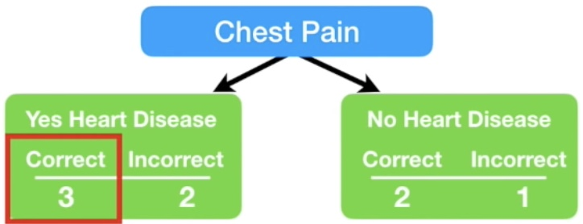
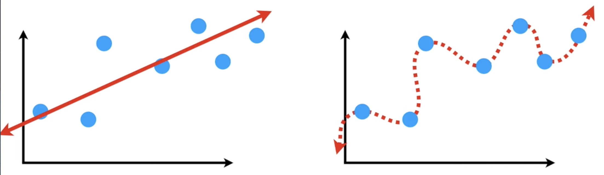
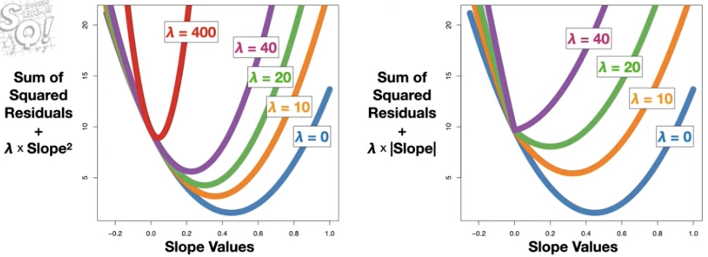

# Table of Contents
[AdaBoost](#adaboost)

[Gradient Boost](#gradient-boost)

[Bias and Variance](#bias-and-variance)

[Boosting and Loss Functions](#boosting-and-loss-functions)

[Regularization](#regularization)

[test](#test)
<!---toc--->

# Notes
[Documentation for google laTex](https://developers.google.com/chart/infographics/docs/formulas?hl=en)

# AdaBoost

I'm learning this method to gain a fundamental understanding of XGBoost, which is a popular classifier algo and used in Litchfield et al, 2021. Check out [this blog post.](https://www.mygreatlearning.com/blog/adaboost-algorithm/)

#### StatQuest

Table 1

Concept
1. Combines a lot of "weak learners" to make classifications
2. Weak leaners are usually stumps (1 node, 2 leaf decision trees)
3. Stumps are weighted
4. The order of each stump is important: errors of first stump influence that of next, etc

Algorithm
1. Each sample (row of table with column factors and classification as last column) gets a sample weight, starting as 1/N.
2. First take the single factor that does the best job classifying samples (example chest pain in Table 1, to do this calculate Gini Impurity index for each stump)
    1. `Gini impurity for each leaf = 1 - P(Yes)^2 - P(No)^2`
    2. `Index = (N_leaf1/N_total) * G(leaf1) + (N_leaf2/N_total) * G(leaf2)`
3. Calculate Gini Impurity index for each stump and use the stump with lowest index as the first stump
    1. Example: Chest pain yes -> how many correct yes and incorrect yes? Chest pain no -> how many correct no and incorrect no?
    2. 
4. Calculate total error for the first stump (sum of **SAMPLE WEIGHTS** of incorrectly classified samples divided by total samples)
5. `Amount of say = 1/2 log((1 - Total Error)/Total Error)`
    1. Figure 1, red line
    2. Total Error goes from 0 to 1
    3. The graph looks like a log plot rotated 90 deg
        1. Low error = positive weight
        2. 50% error is like coin flip = 0 weight
        3. High error = negative weight
        4. Equation is not good for 0 and 1, so error term is added in practice
6. Update all sample weights before moving on to next stump, higher sample weights for incorrectly classified samples
    1. **Incorrectly classified samples:** `New sample weight = sample weight * exp(amount of say)`
        1. Why exp? If the amount of say is good, we scale with a large number
        2. Figure 1, blue line
    2. **Correctly classified samples:** `New sample weight = sample weight * exp(-amount of say)`
        1. Figure 1, purple line
    3.  Figure 1
7. Normalize new sample weights to get 1 (divide each new sample weight by sum of total new weights)
8. Generate the second stump, using new weights
    1. Can use weighted Gini index to determine variable for next stump
    2. Or generate another table that takes into account weights
9. In this case, use second method
    1. Randomly pick a number from 0 to 1
    2. Use the new weights of samples as like a cumulative function, depending on where the random number falls, pick the sample with the closest cumulative weight
        1.  Figure 2
    3. Iterate this process until new table samples match the old
    4. Assign baseline weights 1/N
    5. Use this new table to pick the variable for the second stump
10. Final classifier: Using the forest of stumps, separate into stumps with "Has heart Disease" and those with "Does not have heart disease" based on the new sample
11. Add up amount of say in each group of stumps. Higher sum of amount of say = final class

#### Elements of Statistical Learning

Algorithm 10.1 AdaBoost.M1.
1. Initialize the observation weights ![f1]
2. For ![f2]
    1. Fit a classifer ![f3] to the training data using weights ![f4].
    2. Compute ![f5]
    3. Compute ![f6]
    4. Set ![f7]
3. Output ![f8]

The I() function must output either -1 or 1, I believe.

[f1]: https://chart.apis.google.com/chart?cht=tx&chl=w_i=1/N,\\;\\;i=1,\\;2,\\;...,\\;N
[f2]: http://chart.apis.google.com/chart?cht=tx&chl=m=1\\;\\;to\\;\\;M
[f3]: http://chart.apis.google.com/chart?cht=tx&chl=G_m(x)
[f4]: http://chart.apis.google.com/chart?cht=tx&chl=w_i
[f5]: http://chart.apis.google.com/chart?cht=tx&chl=err_m=\frac{\sum_{i=1}^{N}w_iI(y_i\\;\neq\\;G_m(x_i))}{\sum_{i=1}^{N}w_i}
[f6]: http://chart.apis.google.com/chart?cht=tx&chl=\alpha_m=log((1-err_m)/err_m)
[f7]: http://chart.apis.google.com/chart?cht=tx&chl=w_i\\;\leftarrow\\;w_i\\;\cdot\\;exp[\alpha_m\cdot\\;I(y_\\;\neq\\;G_m(x_i))]\\;,\\;\\;i=1,\\;2,\\;...,\\;N
[f8]: http://chart.apis.google.com/chart?cht=tx&chl=G(x)=sign[\sum_{m=1}^{M}\alpha_mG_m(x)]

#### When to use?
This looks like it's best for binary classification.

# Gradient Boost

Objective: Understanding this to get into the guts of XGBoost

## Statquest

### Concept: Gradient boost for regression

Table 1

1. Gradient boost is similar to Adaboost except it uses leaf instead of stump
2. Then builds tree around leaf, constrained by pre-determined number of leaves. Unlike Adaboost, it scales all trees the same.

Algorithm

1. First leaf is the average of all weights (71.2)
2. Calculate pseudo-residuals (pseudo because Gradient boost not linear regression) into another column
    1. 
3. Build a tree with column variables to predict residuals
    1. f more than 1 variable per leaf, calculate average of variables
    2. At this point, the tree is overfit; low bias but high variance.
    3. Apply learning rate to scale contribution of new tree (0, 1). Usually 0.1.
4. Create new pseudo-residuals with the newly built tree
5. Build another tree with the newly predicted pseudo-residuals
6. Now combine new tree with the old tree to create new pseudo-residuals
    1. `Average weight + (0.1)*Tree1 + (0.1)*Tree2`
7. Keep making trees until reach maximum specified or adding additional trees does not significantly reduce pseudo-residuals.

### Regression model details: Gradient boost for regression

1. Input: Data and Differentiable loss function ![f9]
    1. Required for gradient boost
    2. Most commonly ![f10]
    3. This is similar to loss function in linear regression
    4. Partial derivative of this loss function with respect to Predicted becomes
        1. ![f11]
        2. ![f12]
        3. ![f13]
2. Step 1: Initialize model with constant value: ![f14]
    1. L(y, gamma) is loss function
    2. Gamma: predicted value
    3. Summation: add up all loss values
    4. argmin_gamma: find **predicted value** that minimizes sum of loss function
        1. This is accomplished by taking partial derivative of sum of loss function with respect to **predicted value** and setting = 0
    5. In this case the initial constant is the same as the average of all predictions. F_0(x) = average(y)
3. Step 2: Loop to generate M trees
    1. For m = 1 to M, in practice M = 100 trees
        1. Compute ![f15]
            1. ![f16] just becomes `(-1)*-(Observed-Predicted) = (Observed-Predicted) = Residual`
            2. Then plug in F_m-1(x) for Predicted, which for F_0 is the initial constant
            3. Then do this for each row per tree (r_im)
            4. The derivative is the "gradient" in "gradient boost"
        2. Fit a regression tree to the r_im values and create terminal regions R_Jm for j=1..J_m
            1. Just means use the residuals to create tree where the leaves are R_Jm. If one leaf has more than one residual, then average them.
        3. For ![f17] compute ![f18]
            1. This means that for each leaf in the new tree, calculate the residual ![f18]
            2. Which means summation of previous residuals of only those data rows that contribute to that leaf
            3. 
            4. Eventually we minimize gamma so take partial derivative with respect to gamma and set = 0. This again becomes the AVERAGE of new residuals! So in R_2,1 the value is average of 14.7 and 2.7 = 8.7
        4. Update ![f19]
            1. This just means to make a new prediction for each sample.
            2. The greek letter "v" is the learning rate, which we set to 0.1 usually
            3. 
4. Finally, when a new sample comes in, just run sample through the final formula

### Concept: Gradient boost for classification

Table 2

Gradient boost usually uses 8-32 leaves for trees

1. Similar to logistic regression. Initial prediction is log(odds). log(4/2) = 0.69 = 0.7 for initial leaf.
2. Convert to probably with logistic function `P(odds) = e^log(odds)/(1+e^log(odds))` = 0.67 = 0.7
3. Because probability > 0.5, then assign Yes for every row
4. Calculate pseudo-residuals for each row: `If Yes then (1 - predicted); If no then (predicted - 1)`
    1. 
5. Again create leaves with the residuals
6. Transform the leaves with the formula ![f20]
7. Combine with formula `log(odds) + learning rate X output leaf`, then convert into probability with formula from (2)
8. Use the new predicted probability to calculate residual
9. Again create another tree using residuals, collapsing multiple values within a leaf using the formula from (6)
10. The final classifier uses the formula `predicted log odds = log(inital odds) + learning rate X tree 1 output + learning rate X tree 2 output, etc...` and then convert log odds to probability.

### Classification model details: Gradient boost for classification

1. Input: Data ![f21], and a differentiable loss function ![f9]
    1. x_i refers to row of measurements, y_i refers to classification output
    2. Rationale of loss function
        1. log(likelihood of the observed data given the prediction) = ![f22]
        2. The better the prediction, the larger the log(likelihood) so we want to maximize log(likelihood)
        3. Thus we want to make the loss function -log(likelihood)
        4. ![f23]
        5. Convert predicted probability to log(odds)
        6. ![f24]
    3. Show loss function is differentiable
        1. ![f25]
        2. ![f26]
        3. also ![f27] so we can use either formula
2. Step 1: Initialize model with constant value: ![f14]
    1. y_i refers to observed values, gamma refers to log(odds)
    2. Minimize by setting sum of derivatives = 0
        1. 
        2. Use the above table as an example
        3. `(-1+p) + (-1+p) + (-0+p) = 0`
        4. `p = 2/3` which becomes `log(odds) = log(p/(1-p)) = log(2/1)`. This makes sense because 2 people love Troll 2 and 1 does not.
        5. ![f28]
3. Step 2: Same as step 2 for [Regression model](#regression-model-details-gradient-boost-for-regression)
    1. First compute residuals: `r_i0 = (observed-0.67) = (1-0.67) = 0.33 for Loves Troll 2 and (0-0.67) = -0.67 for Does not love Troll 2`
    2. Then fit regression tree for each variable
    3. Then compute output value for each leaf, except this time instead of taking the derivative with respect to gamma for argmin, approximate with a second order Taylor Polynomial
        1. ![f29]
        2. Now take derivative with respect to gamma
        3. ![f30]
        4. Now set to 0 and solve with respect to gamma
        5. ![f31]
        6. With some calculus and algebra this simplifies to
        7. ![f32]
        8. For the [derivation.](https://youtu.be/StWY5QWMXCw?t=1252)
        9. ![f33] when there is only 1 value in a leaf (for the first leaf)
        10. ![f34] When there are 2 values in a leaf (for the second leaf)
    4. Then update as in Regression model ![f19]
4. Finally, when a new sample comes in, just run sample through the final formula

## Elements of Statistical Learning

## When to use?

[f9]: https://chart.apis.google.com/chart?cht=tx&chl=L(y,\\;F(x))
[f10]: https://chart.apis.google.com/chart?cht=tx&chl=\frac{1}{2}*(Observed-Predicted)^2
[f11]: https://chart.apis.google.com/chart?cht=tx&chl=\frac{\partial\\;f}{\partial\\;Predicted}\frac{1}{2}*(Observed-Predicted)^2
[f12]: https://chart.apis.google.com/chart?cht=tx&chl==-2*\frac{1}{2}*(Observed-Predicted)
[f13]: https://chart.apis.google.com/chart?cht=tx&chl==-(Observed-Predicted)
[f14]: https://chart.apis.google.com/chart?cht=tx&chl=F_0(x)=argmin_\gamma\sum_{i=1}^{n}L(y_i,\\;\gamma)
[f15]: https://chart.apis.google.com/chart?cht=tx&chl=r_{im}=-\left[\frac{\partial\\;L(y_i,F(x_i))}{\partial\\;F(x_i)}\right]_{F(x)=F_{m-1}(x)}\\;for\\;i=1,\\;...,\\;n
[f16]: https://chart.apis.google.com/chart?cht=tx&chl=-\left[\frac{\partial\\;L(y_i,F(x_i))}{\partial\\;F(x_i)}\right]
[f17]: https://chart.apis.google.com/chart?cht=tx&chl=j=1,\\;...,J_m
[f18]: https://chart.apis.google.com/chart?cht=tx&chl=\gamma_{jm}=argmin_\gamma\sum_{x_i\in\\;R_{ij}}^{}L(y_i,\\;F_{m-1}(x_i)%2B\gamma)
[f19]: https://chart.apis.google.com/chart?cht=tx&chl=F_m(x)=F_{m-1}(x)%2B\nu\sum_{j=1}^{J_m}\gamma_{jm}I(x\in\\;R_{jm})
[f20]: https://chart.apis.google.com/chart?cht=tx&chl=\frac{\sum\\;Residual_i}{\sum\\;[Previous\\;Probability_i\times(1-Previous\\;Probability_i)]}
[f21]: https://chart.apis.google.com/chart?cht=tx&chl={(x_i,y_i)}_{i=1}^{n}
[f22]: https://chart.apis.google.com/chart?cht=tx&chl=\sum_{i=1}^{N}y_i\times\\;log(p)%2B(1-y_i)\times\\;log(1-p)
[f23]: https://chart.apis.google.com/chart?cht=tx&chl=L(y,\\;F(p))=-[Observed\times\\;log(p)+(1-Observed)\times\\;log(1-p)]
[f24]: https://chart.apis.google.com/chart?cht=tx&chl=L(y,\\;F(odds))=-Observed\times\\;log(odds)%2Blog(1%2Be^{log(odds)})
[f25]: https://chart.apis.google.com/chart?cht=tx&chl=\frac{\partial}{\partial\\;log(odds)}-Observed\times\\;log(odds)%2Blog(1%2Be^{log(odds)})
[f26]: https://chart.apis.google.com/chart?cht=tx&chl==-Observed%2B\frac{e^{log(odds)}}{1%2Be^{log(odds)}}
[f27]: https://chart.apis.google.com/chart?cht=tx&chl==-Observed%2Bp
[f28]: https://chart.apis.google.com/chart?cht=tx&chl=F_0(x)=log(\frac{2}{1})=0.69
[f29]: https://chart.apis.google.com/chart?cht=tx&chl=L(y_1,F_{m-1}(x_1)%2B\gamma)\approx\\;L(y_1,F_{m-1}(x_1))%2B\frac{d}{dF}(y_1,F_{m-1}(x_1))\gamma%2B\frac{1}{2}\frac{d^2}{dF^2}(y_1,F_{m-1}(x_1))\gamma^2
[f30]: https://chart.apis.google.com/chart?cht=tx&chl=\frac{\partial}{\partial\gamma}L(y_1,F_{m-1}(x_1)%2B\gamma)\approx\frac{d}{dF}(y_1,F_{m-1}(x_1))%2B\frac{d^2}{dF^2}(y_1,F_{m-1}(x_1))\gamma
[f31]: https://chart.apis.google.com/chart?cht=tx&chl=\gamma=\frac{-\frac{d}{dF}(y_1,F_{m-1}(x_1))}{\frac{d^2}{dF^2}(y_1,F_{m-1}(x_1))}
[f32]: https://chart.apis.google.com/chart?cht=tx&chl=\gamma=\frac{Observed-Predicted}{p\times(1-p)}=\frac{Residual}{p\times(1-p)}
[f33]: https://chart.apis.google.com/chart?cht=tx&chl=\gamma_{1,1}=\frac{Residual}{p\times(1-p)}=\frac{0.33}{0.67\times(1-0.67)}=1.5
[f34]: https://chart.apis.google.com/chart?cht=tx&chl=\gamma=\frac{Residual_2%2BResidual_3}{p_2\times(1-p_2)%2Bp_3\times(1-p_3)}=\frac{0.33%2B-0.67}{[0.67\times(1-0.67)]%2B[0.67\times(1-0.67)]}=-0.77

[f40]: https://chart.apis.google.com/chart?cht=tx&chl=\frac{\sum\\;Residual_i}{\sum\\;[Previous\\;Probability_i\times(1-Previous\\;Probability_i)]}

# Bias and Variance

Objective: 

## Statquest

1. Bias = how well a machine learning model can replicate the true underlying relationship in the TRAINING set.
    1. Linear regression for a log relationship = high bias. Polynomial regression for a log relationship = low bias.
    2. Based on residuals.
2. Variance = the difference in fits between datasets.
    1. Linear regression for a log relationship = low variance. Because the error would be consistent across log datasets with some randomness. Polynomial regression = high variance. Because error would vary across different log datasets. It would fit some datasets well and some poorly. This is because it fit so well to the training data.
        1. Polynomial = "Overfit"
3. Finding a sweet spot between simple model and overfitted model = regularization, boosting, bagging.

## Elements of Statistical Learning

## When to use?

# Boosting and Loss Functions

Objective: Why does boosting work? What are loss functions?

## Boosting

[Why boosting?](https://jialinyi94.github.io/CIS_625_Final_Project.pdf) TL;DR Because it can give you the ground truth model for anything. It can give you the math formula to describe "dog."

1. From a statistical point of view, "boosting is minimizing the empirical risk for an asymmetric loss function that penalizes more heavily on incorrect classifications" - Jialin Yi.
2. [VC theory](https://en.wikipedia.org/wiki/Vapnik–Chervonenkis_theory) explains why minimizing empirical risk is **consistent** and thus works for classification.
    1. [Consistency](https://en.wikipedia.org/wiki/Consistency_(statistics)) is a desired property of a statistical procedure as the items in a data set increases indefinitely. A consistent procedure is one such that the outcome of the procedure with unlimited data **should identify the underlying truth.**
    2. "In statistical classification, a consistent classifier is one for which the probability of correct classification, given a training set, approaches, as the size of the training set increases, the best probability theoretically possible if the population distributions were fully known."
    3. Because we want to minimize expected risk.
    4. VC Inequality theorem states that empirical risk becomes a good proxy for expected risk as sampling increases.

## Loss Functions
1. The loss function for Adaboost is an exponential function L(y, f(x)) = exp(-y*f(x)). The loss function for gradient boosting is the partial differential dL/df, where L is the pseudo-residuals.

## When to use?

# Regularization

Objective: Regularization is used in XGBoost so I have to learn this first.

## Statquest

Definition: tuning a regression function by adding an additional penalty term in the error function.

### Ridge Regression

1. Main idea is to find a line that doesn't fit training data so well. Introduce some bias to minimize variance.
    1. "By starting with a slightly worse fit, Ridge Regression can provide better long term predictions"
2. Least squares minimizes sum of squared residuals
3. Ridge regression minimizes ![f35]
    1. lambda X the slope^2 = Ridge regression penalty
4. This penalizes high slopes, because a smaller slope means the dependent variable is less sensitive to changes in the independent variable
5. Lambda is determined by trying different values and performing cross-validation (typically 10-fold, or 1:10 training:testing)
6. This is straightforward for continuous variables, but what about discrete variables?
    1. 
    2. Least squares: Minimize distance between measurements and means within each group.
        1. Size = 1.5 + 0.7 X High Fat Diet
        2. 0.7 is the "Diet difference"
    3. Ridge regression: Minimize distance between measurements + lambda X Diet difference^2
        1. Thus we want a smaller diet difference
7. What about logistic regression?
    1. 
    2. Optimize sum of likelihoods because logistic regression is solved with maximum likelihood: sum of the likelihoods + lambda X slope^2
    3. Thus we want a smaller slope so that the classification is less sensitive to changes in weight
8. Extrapolation to multiple parameters
    1. 
    2. In the above, Size = y-intercept + slope X Weight + diet difference X High Fat Diet
    3. Ridge penalty will be lambda X (slope^2 + diet difference^2)
9. Best thing about Ridge Regression:
    1. In least squares, we need the same amount of measurements as the number of variables (Ex. we need 2 points on a 2D plane to find the best fit line, and 3 points on a 3D plane, etc)
    2. So if we want to relate size of mice to 10,000 genes we need 10,000 mice
    3. This is because you can create any line, plane, etc to minimize sum of squared residuals to 0 if you don't have all the constraints
    2. Ridge regression also minimizes lambda + Slope^2
10. Ridge Regression good for when there are a lot of useful variables

### Lasso Regression

1. Minimize ![f36]
2. Simply absolute value of slope instead of squared as in Ridge Regression
3. Difference: Ridge Regression shrinks slope asymptotically to 0 whereas Lasso Regression can shrink slope to 0
    1. This enables exclusion of useless variables in large equations
4. Lasso Regression good for when there are a lot of useless variables
    1. 

### Elastic-Net Regression

1. Minimize ![f37]
2. This is just a combination of lasso and ridge regression, with lambdas being different
3. Does a better job when there are tons of variables which may or may not be useful

### Ridge vs Lasso Regression

1. 
2. For Ridge Regression (left side), slope never = 0 even with large lambda
3. For Lasso Regression (right side), slope = 0 when lambda = 40

[f35]: https://chart.apis.google.com/chart?cht=tx&chl=sum\\;of\\;squared\\;residuals%2B\lambda\times\\;slope^2
[f36]: https://chart.apis.google.com/chart?cht=tx&chl=sum\\;of\\;squared\\;residuals%2B\lambda\times\\;|slope|
[f37]: https://chart.apis.google.com/chart?cht=tx&chl=sum\\;of\\;squared\\;residuals%2B\lambda_1\times\\;|variable_1|\\;%2B\\;...\\;%2B\\;|variable_x|\\;%2B\lambda_2\times\\;variable_{1}^2\\;%2B\\;...\\;%2B\\;variable_{x}^2

## Elements of Statistical Learning

## When to use?

# test
[back to toc](#table-of-contents)

Objective: 

## Statquest

## Elements of Statistical Learning

## When to use?

